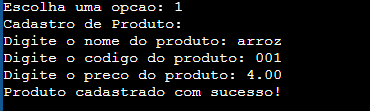
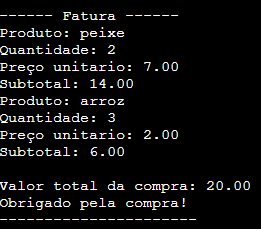
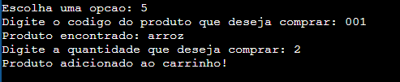

# README---SISTEMASUPERMERCADO
# Sistema de Supermercado em C

## Descrição
Este é um sistema básico que tem como objetivo fornecer uma interface simples para gerenciar produtos em um ambiente de supermercado. Para realização do programa, foi ultilizado a lingagem de programação C, implementando conceitos de estrutura de dados, como structs, arrays, e funções. O Sistema permite entrada e saída de dados, tais como suas estruturas e também, o controle de fluxo. 

## Funcionalidades
- **Cadastrar Produto:** Adiciona novos produtos com nome, preço e código.
- **Listar Produtos:** Exibe todos os produtos cadastrados no sistema.
- **Verificar produto :** Permite que o usuário verifique se o produto já se encontra no carrinho.
- **Comprar produto:** Permite que o usuário selecione produtos para compra e os adicione no carrinho.
- **Remover do Carrinho:** Opção para remover produtos do carrinho.
-  **Visualizar pedido:** Usuário pode visualizar os itens de seu carrinho, suas quantidades e códigos.
- **Finalizar Compra:** Processa a compra e exibe o total.

- ## Possíveis erros e tratamentos
Em algumas das funções adicionadas no sistema, o usuário pode inserir um dado de entrada em que o proejeto não consegue lidar. Sendo assim, foram adicionadas mensagens de direcionamento ao usuario pedindo que o mesmo retorne dados válidos! 

## Tecnologias Utilizadas
- Linguagem: C
- Compilador: GCC

## Instalação e uso do programa
Para instalar o sistema, siga os passos abaixo:

1. Abra o link disponibilizado do arquivo no GitHub.
2. Navegue até o diretório do projeto - SISTEMA SUPERMERCADO C - .
3. Abra o arquivo main.c (nele contém o código).
4. Compile o projeto na ferramenta VsCode.
5. Rode o programa.

## Exemplos de algumas funções do código compilado 
 

